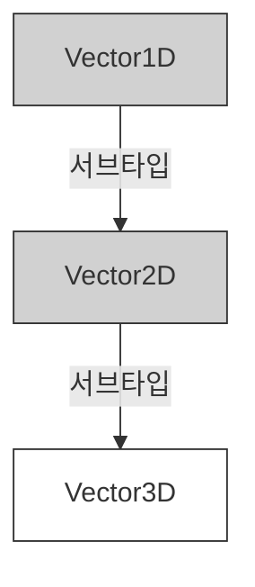
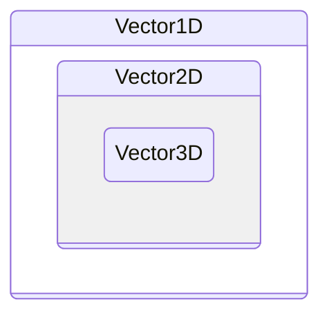

# 📂 [Week 1] Item 6~10: 타입 시스템의 기초

---

## 🏷️ Metadata

학습일: 2025년 12월 21일

주차: #Week1

키워드: #TypeScript #1주차 #집합론 #타입공간 #값공간 #타입단언

---

## 🚀 핵심 요약

> [!abstract] 이 섹션의 핵심 한 줄
>
> 편집기를 잘 이용하여 언어 서비스의 이득을 봐야햔다.
> 타입을 '값의 집합'으로 이해하여 할당 가능성을 판단해야 한다.
> 타입 단언보단 타입 선언을 사용해야한다.
> 타입 공간과 값 공간을 엄격히 구분하고, 타입 단언보다는 안전한 타입 선언을 지향해야 한다.

---

## ✍️ 주요 내용 정리

### Item 6. 편집기를 이용해 타입 시스템 탐색하기

- 편집기를 적극 활용해야한다.
    - 언어 서비스(Language Service): 타입스크립트 서버가 제공하는 자동 완성, 심볼 정보, 정의 이동, 리팩터링 기능을 말한다.
    - 타입 추론 확인: 변수에 마우스를 올려 타입스크립트가 타입을 어떻게 추론하고 있는지 수시로 확인해야 한다. 기대와 다르게 추론된다면 타입 선언이 필요한 시점이다.
    - `dom.lib.ts`와 같은 표준 라이브러리 타입 선언을 찾아가면 브라우저 API가 어떻게 모델링되었는지 학습할 수 있다.

### Item 7. 타입이 값의 집합이라고 생각하기

- 할당 가능성(Assignability): 타입스크립트에서 "A는 B에 할당 가능하다"는 말은 "집합 A가 집합 B의 부분 집합이다"라는 뜻이다.
- 잉여 속성 체크 (Excess Property Checking): 객체 리터럴을 변수에 직접 할당하거나 인수로 전달할 때, 선언된 속성 외에 다른 속성이 있는지 엄격하게 검사하는 기능이다. 임시 변수에 담아 전달하면 이 체크를 우회할 수 있는데, 이는 구조적 타이핑의 원칙과 일치한다.
- 타입은 유한(boolean, 리터럴)하거나 무한(number, string..)하다.
- 타입 체커는 하나의 집합이 다른 집합의 부분 집합인지 확인한다.
- A는 B를 상송 = A는 B의 서브타입
- A는 B에 할당 = A는 B의 부분집합
- 타입은 집합으로 표현이 가능하다. (never, literal, union, unit)
    - never (공집합): 아무런 값도 가질 수 없는 타입.
    - Literal - unit (유닛 타입): 단 하나의 값만 포함하는 집합.
    - Union (|): 값 집합들의 합집합. - Persion | Lifespan
    - Intersection 인터넥션 (&): 값 집합들의 교집합. (속성 관점에서는 두 인터페이스의 속성을 모두 합친 형태가 된다.) - Person & Lifespan

```typescript
interface Person { name: string;}
interface Lifespan { birth: Date; death?: Date;}
type MyTypeUnion = Person | Lifespan;
-- 각 속성이 공통으로 갖는 값이 없으므로 naver. name 만 있어도 되고, birth 만 있어도 됨

type MyTypeIntersection = Person & Lifespan;
-- 각 집합을 하나의 묶음으로 보고 타입이 정해짐. name 도 있어야 하고, birth 도 있어야 함
```

- keyof: 타입 공간에서 객체 타입의 키(key)들을 문자열 리터럴 유니온으로 반환한다. `keyof (A & B)`는 `(keyof A | keyof B)`와 같다.

타입은 서브 타입(부분 집합)인 경우 할당할 수 있다.
- Vertor3D 는 Vertor2D의 서브타입이고 Vertor2D  는 Vertor1D 의 서브타입이다.
- 클래스 관점에서는 서브클래스가 된다.


- 아래 표를 보면 Vector3D 가 가진게 가장 많으니 바깥에 있어야 하는게 아닌가 생각할 수 있지만 가장 안쪽에 있다. 
	- 그 이유는 객체의 프로퍼티가 많을수록 타입의 범위(집합의 크기)는 좁아지기 때문에 Vector3D가 가장 안쪽에 있다.
	- 타입은 조건이다. 타입을 정의하는 것은 이 객체는 최소한 이런 조건을 만족해야 한다고 제약을 거는 것이다. 
    - Vector1D ({x}): "최소한 x는 있어야 한다." (조건이 매우 느슨함)
    - Vector3D ({x, y, z}): "최소한 x도 있고, y도 있고, z도 있어야 해." (조건이 매우 까다로움)
	- 조건이 까다로울수록 통과하는 객체가 적어진다 (집합의 개념)


```typescript
interface Vertor1D {x: number}
interface Vertor2D extends Vertor1D {y: number}
interface Vertor3D extends Vertor2D {z: number}
```

### Item 8. 타입 공간과 값 공간의 심볼 구분하기

- 공간의 구분: 컴파일 시 제거되는 것은 타입 공간, 남는 것은 값 공간이다.
    - 심벌(Symbol)은 타입 공간이나 값 공간에 동일한 키워드로 사용될 수 있음
    - const, let 과같은 영역에서 값 공간으로 쓰일 수 있다.
    - type, interface 와 같이 타입 공간에서 사용할 수 있다
- 클래스의 이중성: `class`는 타입으로 쓰이면 인스턴스의 형태(속성/메서드)를 나타내고, 값으로 쓰이면 생성자 함수를 나타낸다..
- 타입 선언(:) 또는 단언문(as) = 타입 케스팅 다음에 다오는건 타입 공간이다.
- typeof의 혼란:
    - 값 공간의 `typeof`: JS 런타임의 타입(문자열)을 반환.
    - 타입 공간의 `typeof`: 해당 값의 타입을 추출하여 타입스크립트 타입으로 반환.
- 자바스크립트는 6개의 런타임 타입이 존재한다.
    - nunber, boolean, undefined, object, function

```typescript
const v = typeof Cylinder; // 값이 "function"
type T = typeof Cylinder; // 타입이 typeof Cylinder

```

- 값이 동일하더라도 타입이 다를 수 있다. `Array<string>, string[]..`
- 타입 속성을 얻을땐 `obj['field']` 를 사용해야한다.
- 자바스크립트의 this 키워드와 타입스크립트의 this 타입은 다르다.
    - 서브클래스의 메서드 체인을 구현할 때 사용된다.
- 구조 분해 할당의 실수: `function email({to: Person})`은 `to`라는 인수를 `Person`이라는 이름의 변수로 치환하는 JS 문법이다. 타입은 반드시 `{to}: {to: Person}` 처럼 콜론 뒤에 명시해야 한다. (순간 속을뻔)

```ts
function email({to: Person, subject: string, body: string}) { /* ... */ }
```

- 모든 값은 타입을 가진다. 하지만 타입을 만들고 사용하지 않는다면 값을 가지지 않는다.
- class, enum 키워드는 타입과 값 두가지로 사용될 수 있다.
- typeof, this 등 연산자들은 타입공간과 값 공간에서 다르게 쓰일 수 있다.

### Item 9. 타입 단언보다는 타입 선언을 사용하기

- 타입 선언 (`: Type`): 변수가 특정 인터페이스를 만족하는지 검사한다. 가장 권장되는 방법이다.
- 타입 단언 (`as Type`): 타입 체커에게 "내가 너보다 잘 아니까 군말 말고 이 타입으로 간주해"라고 강제하는 것이다. 런타임 에러의 주범이 될 수 있다. 타입 케스팅(as 키워드나 <> 문법을 사용)
- 단언이 필요한 경우: 타입 체커가 도달할 수 없는 도메인 지식이 있을 때(예: DOM 엘리먼트 접근, 비동기 응답 결과 확신 등)
- Non-null 단언 (`!`): 값이 `null`이나 `undefined`가 아님을 단언할 때 사용한다. 가급적 조건문으로 체크하는 것이 안전하다.
- 모든 타입은 unknown 의 서브타입이다.
- 화살표 함수의 반환 타입을 명시하는 것이 중요하다.

### Item 10. 객체 래퍼 타입(String, Number, Boolean, Symbol, BigInt) 피하기

- 래퍼 객체의 존재 이유: 자바스크립트는 기본형(primitive)의 메서드(예: `toUpperCase`)를 호출할 때 임시로 래퍼 객체를 생성하고 작업 후 즉시 폐기한다.
    - 자바스크립트의 string 동작방식
    - string 기본형에 charAt() 을 사용하면 기본형을 String 객체로 래핑하고 메서드를 호출하고 래핑을 버린다.
    - String.prototype 을 몽키-패치하면 내부 동작을 관찰할 수 있다.
    - 석사 마친 형이 Map 이나 Set 을 직접 구현해서 쓴다는데 이걸 말하나봄
- 객체 이외애 기본형 값들에 대한 7가지 타입 (string, nuber, boolean, null, undefined, symbol, bigint)
    - bigint 는 왜 있는지 모르겠다. 개같다.
    - null, undefined 는 객체 래퍼가 없다.
    - 기본형은 메서드를 가지지 않는다는 점에서 객체와 구분된다. (불편 = immutable)
- 타입 정의 시 주의: `String`은 객체 타입이고 `string`은 기본형 타입이다. `string`은 `String`에 할당 가능하지만, 그 반대는 불가능하다.
    - string 타입을 String 으로 작성하면 문제가 발생할 수 있다.
    - ['a', 'b'].includes(String 타입)
    - string 은 String 에 할당할 수 있지만, String 은 string 에 할당이 불가능하다.
    - 대부분 타입은 기본형 타입으로 되어있다.
    - 타입스크립트에서는 항상 소문자로 시작하는 기본형 타입을 사용해야 한다. `BigInt` 또한 기본형 타입 `bigint`를 사용하라.

---

## 💻 코드 예시

**❌ 지양해야 할 코드**

```typeScript
// 1. 타입 단언 남용 (Item 9)
interface User { id: string; name: string; }
const user = {} as User; // 속성이 없는데도 에러가 나지 않음 (위험!)

// 2. 구조 분해 할당에서의 타입 지정 실수 (Item 8)
function register({name: string}) { // name 변수를 'string'이라는 이름의 변수로 바꾼 것임
  console.log(string); 
}

// 3. 래퍼 객체 타입 사용 (Item 10)
function shout(s: String) { // 대문자 String 지양
  return s.toUpperCase();
}
```

**✅ 지향해야 할 코드**

```typeScript
// 1. 타입 선언 사용 (Item 9)
const correctUser: User = { 
  id: '001', 
  name: 'Alice' 
}; // 속성이 빠지면 즉시 컴파일 에러 발생

// 2. 올바른 구조 분해 할당 타입 선언 (Item 8)
function registerCorrect({name}: {name: string}) {
  console.log(name);
}

// 3. 잉여 속성 체크 확인 (Item 7)
interface Options { title: string; darkMode?: boolean; }
const o: Options = { title: 'Main', darkmode: true }; // 오타(darkmode) 가 발견되어 빨간줄 생김
const rawOptions = { title: 'Main', darkmode: true };
const o2: Options = rawOptions; // 임시 변수를 통하면 체크 우회 (구조적 타이핑)
```
